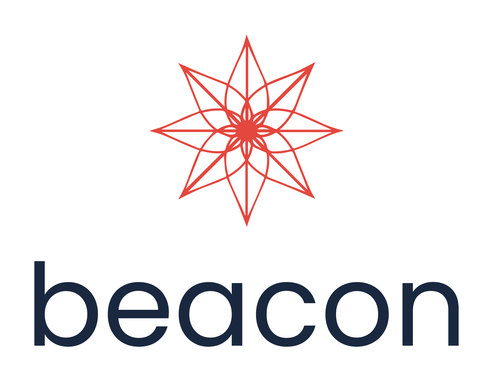

---

Beacon is a multiparadigm C++ event management library with focus on fast and simple integration.
Be wary, this is a work in progress, compatibility may break in future versions.
If you are familiar with .NET's event manager classes you'll find this library easy to use!

# Features

* Single event handler
* Multiple event handler and dispatcher
* Callbacks
* Interval timing events

# Examples

## Simple interval event

```c++
#include "beacon.hpp"
#include <cstdio>

int main(int argc, char** argv) {
    
    beacon::interval inter;
    inter.set(1000, [](const char* msg){ puts(msg); }, "Hello, World!");
    
    return 0;
}
```
```"Hello, World!"``` will be printed every 1000 milliseconds


# Installation

The library is header only, integrating it to your project is as easy as including beacon.hpp and you are ready to go!

# License


## The MIT License (MIT)

Copyright © 2021 Imanol Fotia

Permission is hereby granted, free of charge, to any person
obtaining a copy of this software and associated documentation
files (the “Software”), to deal in the Software without
restriction, including without limitation the rights to use,
copy, modify, merge, publish, distribute, sublicense, and/or sell
copies of the Software, and to permit persons to whom the
Software is furnished to do so, subject to the following
conditions:

The above copyright notice and this permission notice shall be
included in all copies or substantial portions of the Software.

THE SOFTWARE IS PROVIDED “AS IS”, WITHOUT WARRANTY OF ANY KIND,
EXPRESS OR IMPLIED, INCLUDING BUT NOT LIMITED TO THE WARRANTIES
OF MERCHANTABILITY, FITNESS FOR A PARTICULAR PURPOSE AND
NONINFRINGEMENT. IN NO EVENT SHALL THE AUTHORS OR COPYRIGHT
HOLDERS BE LIABLE FOR ANY CLAIM, DAMAGES OR OTHER LIABILITY,
WHETHER IN AN ACTION OF CONTRACT, TORT OR OTHERWISE, ARISING
FROM, OUT OF OR IN CONNECTION WITH THE SOFTWARE OR THE USE OR
OTHER DEALINGS IN THE SOFTWARE.